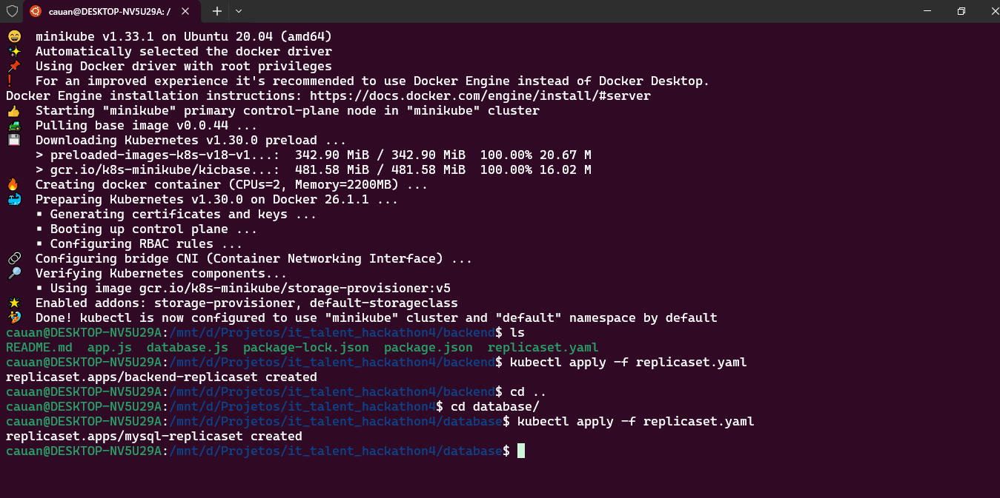
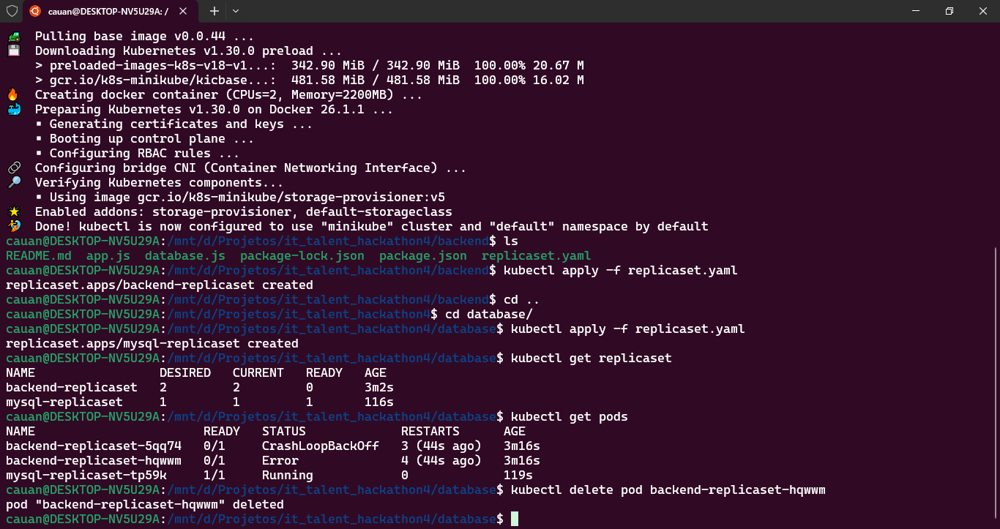
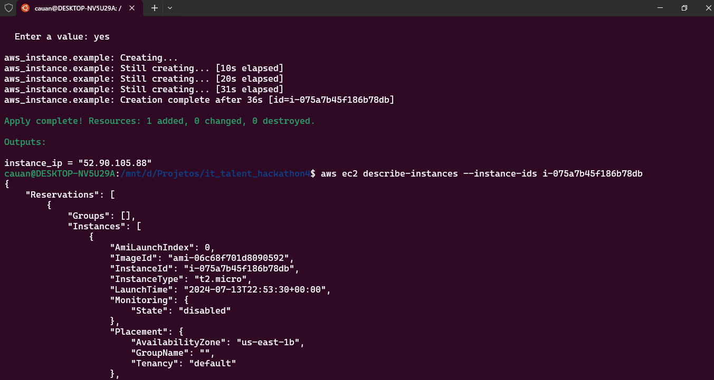

# IT TALENT – TURMA DEVOPS 2024 – 4º HACKATHON

## Pré-requisitos

- Minikube com kubectl
- Conta no GitHub e AWS
- Conta no Terraform Cloud

## Desafio

O nosso Hackathon será dividido em duas partes:
1. **1ª Parte**: Consiste em situações usando Kubernetes local e Terraform Cloud com AWS (8,0 pontos)
2. **2ª Parte**: Consistirá de Prometheus e Grafana (2,0 pontos)

## Objetivos Específicos

### Parte 1: Kubernetes (Orquestração de Containers)

Para essa atividade, iremos criar um ReplicaSet com 1 instância do Banco de Dados e 2 do backend, usando os repositórios:
- Projeto de Banco de Dados: [moisesAlc/Banco-IT_Talent](https://github.com/moisesAlc/Banco-IT_Talent)
- Projeto de backend: [moisesAlc/Backend-IT_Talent](https://github.com/moisesAlc/Backend-IT_Talent)

#### Passos:

1. Criar um ReplicaSet com os seguintes componentes:
   - 1 instância do banco de dados (MySQL)
   - 2 instâncias do backend (Node.js)
   
2. Criar um repositório no GitHub onde subir o(s) arquivo(s) .yaml necessários para a criação do ReplicaSet.

3. Adicionar ao repositório:
   - Um print com a execução do ReplicaSet.
   - Um print com a exclusão de um dos pods do ReplicaSet.
   - Um novo print demonstrando a subida de um novo pod para a normalização do ReplicaSet, feita automaticamente pelo Kubernetes.

#### Arquivo YAML para o Banco de Dados (MySQL)

```yaml
apiVersion: apps/v1
kind: ReplicaSet
metadata:
  name: mysql-replicaset
spec:
  replicas: 1
  selector:
    matchLabels:
      app: mysql
  template:
    metadata:
      labels:
        app: mysql
    spec:
      containers:
      - name: mysql
        image: mysql:5.7
        env:
        - name: MYSQL_ROOT_PASSWORD
          value: "rootpassword"
        - name: MYSQL_DATABASE
          value: "mydatabase"
        ports:
        - containerPort: 3306
```

#### Arquivo YAML para o Backend (Node.js)

```yaml
apiVersion: apps/v1
kind: ReplicaSet
metadata:
  name: backend-replicaset
spec:
  replicas: 2
  selector:
    matchLabels:
      app: backend
  template:
    metadata:
      labels:
        app: backend
    spec:
      containers:
      - name: backend
        image: node:14
        command: ["node", "app.js"]
        ports:
        - containerPort: 3000
        env:
        - name: DB_HOST
          value: "mysql-replicaset"
        - name: DB_USER
          value: "root"
        - name: DB_PASSWORD
          value: "rootpassword"
        - name: DB_NAME
          value: "mydatabase"
```

### Parte 2: Terraform (Infraestrutura como Código)

Para essa atividade, você deverá criar uma instância EC2 na AWS via Terraform Cloud, conforme explicado no vídeo da aula assíncrona de Terraform.

#### Passos:

1. Criar os arquivos Terraform necessários:
   - `main.tf`
   - `variables.tf`
   - `output.tf`

2. Subir os arquivos para um repositório no GitHub.

3. Adicionar ao repositório:
   - Um print da instância rodando.
   - Um print da execução correta no Terraform Cloud.

#### Arquivo Terraform `main.tf`

```hcl
provider "aws" {
  region = "us-east-1"
}

resource "aws_instance" "example" {
  ami           = "ami-06c68f701d8090592"
  instance_type = "t2.micro"

  tags = {
    Name = "ExampleInstance"
  }
}
```

#### Arquivo Terraform `variables.tf`

```hcl
variable "instance_type" {
  description = "Type of instance to create"
  default     = "t2.micro"
}
```

#### Arquivo Terraform `output.tf`

```hcl
output "instance_ip" {
  value = aws_instance.example.public_ip
}
```

## Entrega

- Crie repositórios no GitHub para as atividades de Kubernetes e Terraform.
- Adicione todos os arquivos e prints solicitados.
- Responda no classroom com os links para os seus repositórios até 14/07/24, 23h59.

## Avaliação

- Atividade de Kubernetes: 4,0 pontos
- Atividade de Terraform: 4,0 pontos
- Entregas no prazo máximo têm nota 10.

## Imagens



